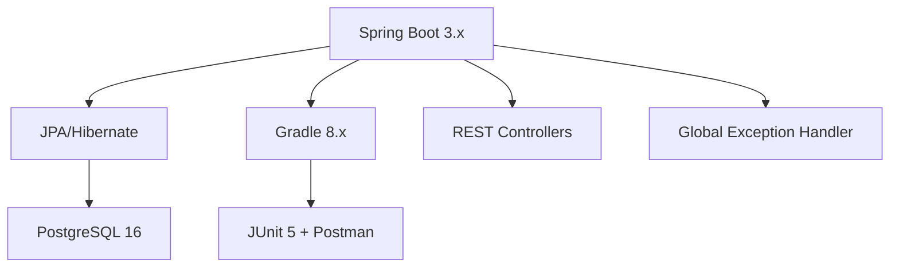
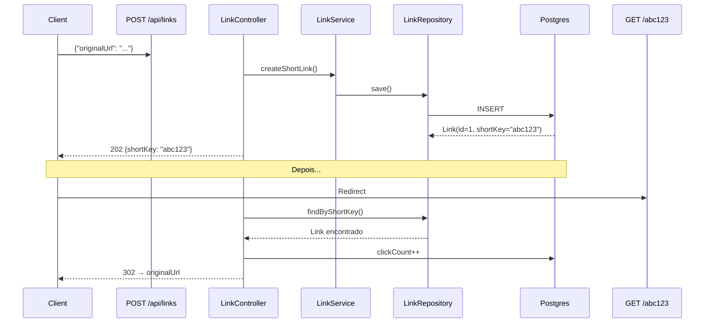

# 🔗 **LinkShortener** - API Spring Boot

[
[
[
[
[

**API completa para encurtar links estilo Bit.ly/TinyURL** 🚀


## ✨ **Funcionalidades**

| ✅ **Encurtador** | ✅ **Redirect** | ✅ **Analytics** | ✅ **Tratamento de Erros** |
|---|---|---|---|
| Gera keys de 7 caracteres únicos | Redireciona automaticamente | Conta cliques por link | 404 elegante com `@ControllerAdvice` |
| Valida URLs | Incrementa contador | `Optional<Link>` seguro | ResponseStatusException |

## 🛠 **Tech Stack**



## 📖 **Endpoints**

| Método | Endpoint | Descrição | Response |
|--------|----------|-----------|----------|
| `POST` | `/api/links` | **Encurta URL** | `202 Accepted` + `shortKey` |
| `GET` | `/{key}` | **Redirect** | `302 Found` → URL original |
| `GET` | `/api/stats/{key}` | **Estatísticas** | `{ clicks, createdAt, lastClick }` |

### **Exemplo de uso (Postman/Insomnia)**

```bash
# 1. Encurtar link
curl -X POST http://localhost:8080/api/links \
  -H "Content-Type: application/json" \
  -d '{"originalUrl": "https://google.com"}'
```

**Response:**
```json
{
  "shortKey": "abc1234"
}
```

```bash
# 2. Acessar → REDIRECT AUTOMÁTICO!
http://localhost:8080/abc1234
→ https://google.com (302)
```

## 🚀 **Como rodar localmente**

### **1. Pré-requisitos**
```bash
Java 17+ | Gradle 8+ | PostgreSQL 16
```

### **2. Banco de dados**
```sql
-- Crie o banco 'linkshortener'
CREATE DATABASE linkshortener;
```

### **3. Clonar e rodar**
```bash
git clone https://github.com/victoremeireles/linkshortener.git
cd linkshortener
./gradlew bootRun
```

**✅ API rodando em `http://localhost:8080`**

### **4. Testar**
```bash
curl -X POST http://localhost:8080/api/links \
  -H "Content-Type: application/json" \
  -d '{"originalUrl": "https://github.com"}'
```

## 🧪 **Testes**

```bash
# Rodar testes unitários
./gradlew test

# Cobertura de código
./gradlew jacocoTestReport
```

**Ferramentas:** JUnit 5 + Postman Collection incluída

## 📁 **Estrutura do Projeto**

```
linkshortener/
├── controller/
│   └── LinkController.java
├── exception/
│   └── GlobalExceptionHandler.java
├── entity/
│   └── Link.java
├── repository/
│   └── LinkRepository.java
├── service/
│   └── LinkService.java
├── build.gradle
└── README.md
```

## 🔍 **Como funciona internamente**



## 🎯 **Por que este projeto?**

**Portfólio perfeito** para demonstrar:
- [x] **Spring Boot REST API** completa
- [x] **JPA/Hibernate** + PostgreSQL
- [x] **Exception Handling** global
- [x] **Redirect HTTP** com `HttpServletResponse`
- [x] **DTOs** + Validação
- [x] **Optional** para segurança
- [x] **Clean Architecture** (Controller → Service → Repository)

## 📈 **Roadmap futuro**

- [ ] **Dashboard Frontend** (React/Vue)
- [ ] **Rate Limiting** (Spring Security)
- [ ] **QR Code** por link
- [ ] **Expiração** de links
- [ ] **Deploy** (Railway/Docker/Heroku)

## 👨‍💻 **Autor**

**Victor Eduardo Meireles**  
💻 Software Developer | 🎸 Guitar Player | 📈 Trading Bot Developer  
[GitHub](https://github.com/victoremeireles) | [LinkedIn](https://linkedin.com/in/victoremeireles) | 🌎 Rio de Janeiro, RJ

## 📄 **Licença**

Este projeto está sob a licença MIT - veja o arquivo [LICENSE](LICENSE) para detalhes.

***

***
